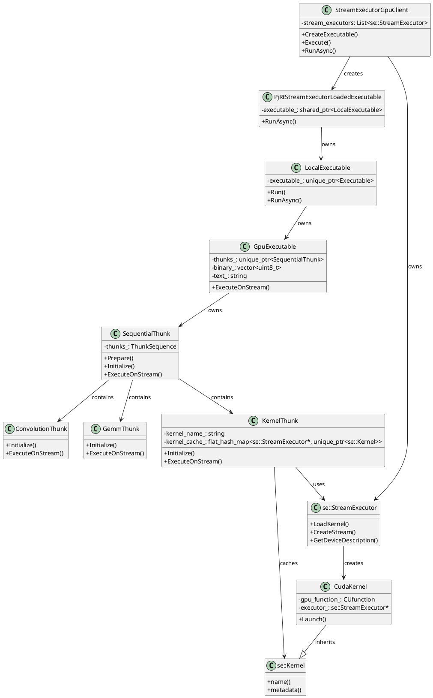
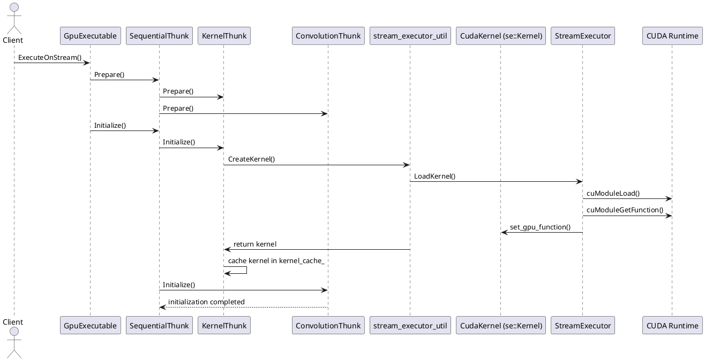
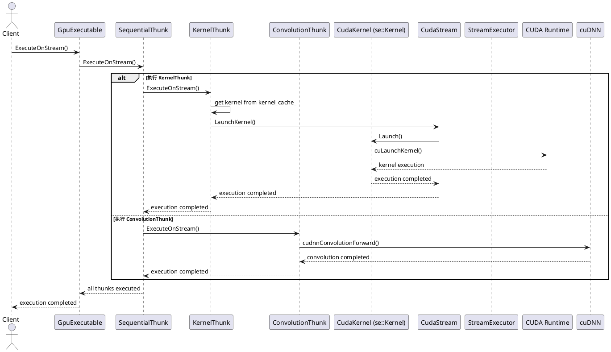

          
# XLA 执行编译后可执行程序的完整过程

## 一、核心组件分析

### 1. CudaStream
**关键属性**：
- `StreamExecutor* executor_`：指向流执行器，提供设备管理和操作接口
- `CUstream stream_handle_`：CUDA 流的底层句柄，是 CUDA API 操作的核心

**主要功能**：
- 管理 GPU 命令队列
- 提供内存操作接口（Memcpy、Memset 等）
- 支持内核启动和事件管理
- 处理主机回调函数

### 2. CudaKernel (se::Kernel)
**关键属性**：
- `CUfunction gpu_function_`：CUDA 内核函数的句柄
- `StreamExecutor* executor_`：指向流执行器
- `unsigned arity_`：内核参数数量

**主要功能**：
- 封装 CUDA 内核函数
- 提供内核启动接口
- 管理内核元数据和参数信息

**创建与管理**：
- **创建过程**：在 `KernelThunk::Initialize()` 中通过 `CreateKernel()` 函数创建
  - 根据内核名称从编译后的二进制或文本中加载内核
  - 设置内核参数数量和共享内存需求
- **缓存管理**：通过 `KernelThunk` 中的 `kernel_cache_`（`absl::flat_hash_map<se::StreamExecutor*, std::unique_ptr<se::Kernel>>`）按设备缓存
  - 避免重复加载相同内核，提高性能
  - 确保每个 StreamExecutor 有自己的内核实例

**在执行过程中的作用**：
- **初始化阶段**：在 `KernelThunk::Initialize()` 中加载并缓存
- **执行阶段**：在 `KernelThunk::ExecuteOnStream()` 中从缓存获取并用于启动内核
- **参数传递**：通过 `ExecuteKernelOnStream()` 传递内核参数和启动配置
- **生命周期**：由 `KernelThunk` 管理，与 `KernelThunk` 生命周期一致

### 3. KernelThunk
**关键属性**：
- `std::string kernel_name_`：内核函数名称
- `LaunchDimensions launch_dimensions_`：内核启动的线程和块维度
- `absl::flat_hash_map<se::StreamExecutor*, std::unique_ptr<se::Kernel>> kernel_cache_`：按设备缓存加载的内核

**主要功能**：
- 管理内核的加载和缓存
- 处理内核参数和缓冲区分配
- 协调内核执行流程

### 4. GpuExecutable

**核心角色定位**：
- **编译产物**：作为编译阶段的最终输出，包含了编译后的 GPU 可执行代码和执行计划
- **执行入口**：作为执行阶段的起点，提供了实际执行编译后代码的能力

**核心组成**：
```cpp
class GpuExecutable : public Executable {
 private:
  // 编译后的二进制代码
  std::vector<uint8_t> binary_;
  // 编译后的汇编文本
  std::string text_;
  // DNN 编译图
  BinaryMap dnn_compiled_graphs_;
  // 执行计划（thunk 序列）
  std::unique_ptr<SequentialThunk> thunks_;
  // 缓冲区分配信息
  const std::vector<const BufferAllocation*> allocation_ptrs_;
};
```

**GpuExecutable 是编译与执行的关键连接点**：
1. **信息聚合**：GpuExecutable 聚合了编译阶段的所有产物，包括二进制代码、执行计划和资源分配信息
2. **执行能力**：它提供了 `ExecuteOnStream()` 方法，是实际执行编译后代码的入口点
3. **抽象与具体的桥梁**：它继承自抽象的 `Executable` 类，同时提供了 GPU 特定的实现
4. **PjRt 集成**：通过 LocalExecutable 和 PjRtStreamExecutorLoadedExecutable 的包装，融入了 PjRt 执行框架

### 5. Thunk系统详解

**Thunk类型与分类**：
- 可以参考'ThunkEmitter::EmitHloInstruction'函数的处理。
#### 核心计算Thunk
- **KernelThunk**：执行编译后的CUDA内核
- **ConvolutionThunk**：执行卷积操作，调用cuDNN库
- **GemmThunk**：执行矩阵乘法，调用cuBLAS库
- **CustomKernelThunk**：执行自定义CUDA内核

#### 内存操作Thunk
- **CopyThunk**：执行设备间内存拷贝
- **MemzeroThunk**：执行内存置零操作
- **Memset32BitValueThunk**：执行内存设置操作

#### 控制流Thunk
- **SequentialThunk**：按顺序执行多个Thunk
- **ConditionalThunk**：执行条件分支
- **WhileThunk**：执行循环操作

#### 集体通信Thunk
- **AllReduceThunk**：执行all-reduce操作
- **AllGatherThunk**：执行all-gather操作
- **AllToAllThunk**：执行all-to-all操作
- **CollectiveBroadcastThunk**：执行广播操作

#### 其他Thunk
- **CustomCallThunk**：执行自定义调用
- **FftThunk**：执行FFT操作
- **InfeedThunk**：处理输入数据
- **OutfeedThunk**：处理输出数据

**SequentialThunk的分发执行机制**：
- **执行流程**：按顺序调用每个Thunk的`ExecuteOnStream`方法
- **分发机制**：不关心具体Thunk类型，统一调度
- **执行顺序**：严格按照Thunk序列顺序执行，确保依赖关系

**Thunk执行的三个阶段**：
1. **准备阶段（Prepare）**：请求运行时所需的共享资源
2. **初始化阶段（Initialize）**：初始化执行所需的内部状态
3. **执行阶段（Execute）**：在指定流上执行实际操作

## 二、执行流程详解

### 1. 编译到执行的完整流程

#### 编译阶段
1. **前端处理**：XLA 前端（如 TensorFlow、JAX 等）将计算图转换为 HLO 表示
2. **HLO 优化**：通过一系列优化 pass 对 HLO 进行优化
3. **代码生成**：
   - **IrEmitter** 生成 MLIR 代码
   - **GPU 代码生成器** 将 MLIR 转换为 CUDA 代码
   - **NVPTX 编译器** 将 CUDA 代码编译为 PTX 或 cubin 文件
4. **GpuExecutable 构建**：
   - 收集编译结果（二进制代码、汇编文本、DNN 编译图）
   - 生成 thunk 序列，描述如何执行编译后的代码
   - 构建 `GpuExecutable` 实例，封装所有执行所需的信息

#### 封装到 PjRt 层
1. **LocalExecutable 包装**：
   ```cpp
   // LocalExecutable 构造函数
   LocalExecutable(std::unique_ptr<Executable> executable, Backend* backend,
                  ExecutableBuildOptions build_options);
   ```
   这里的 `executable` 就是 `GpuExecutable` 实例

2. **PjRtStreamExecutorLoadedExecutable 包装**：
   ```cpp
   // PjRtStreamExecutorLoadedExecutable 构造函数
   PjRtStreamExecutorLoadedExecutable(
       std::unique_ptr<LocalExecutable> executables,
       bool parameter_is_tupled_arguments,
       std::shared_ptr<DeviceAssignment> device_assignment,
       CompileOptions compile_options,
       std::vector<LogicalDeviceIds> addressable_device_logical_ids,
       std::vector<PjRtDevice*> addressable_devices,
       PjRtStreamExecutorClient* client, std::vector<Shape> parameter_shapes,
       xla::Shape result_shape, std::vector<int> output_memory_space_kind_ids);
   ```
   这里的 `executables` 就是包装了 `GpuExecutable` 的 `LocalExecutable`

### 2. 执行阶段流程

#### 初始化与准备
1. **StreamExecutor 初始化**：
   - 创建并初始化 StreamExecutor 实例，与特定 GPU 设备关联
   - 加载 CUDA 驱动和运行时

2. **CudaStream 创建**：
   - 通过 `CudaStream::Create()` 创建流实例
   - 初始化 `stream_handle_`，与 CUDA 运行时建立连接

3. **GpuExecutable 初始化**：
   - **thunks_ 初始化**：通过构造函数参数 `std::unique_ptr<SequentialThunk> executable` 初始化
   - 该参数由编译阶段的 IrEmitter 生成，包含了所有需要执行的 thunk 序列
   - 同时初始化 `allocation_ptrs_`、`buffer_assignment_` 等缓冲区管理相关成员

4. **Thunk 准备**：
   - **SequentialThunk 准备**：调用 `SequentialThunk::Prepare()` 准备所有 thunk
   - **各个Thunk准备**：根据Thunk类型执行相应的准备操作

5. **Thunk 初始化**：
   - **SequentialThunk 初始化**：调用 `SequentialThunk::Initialize()` 初始化所有 thunk
   - **KernelThunk 初始化**：
     - 根据内核名称从编译后的模块中查找内核函数
     - 调用 `stream_executor_util::CreateKernel()` 创建内核
     - `CreateKernel()` 内部调用 `StreamExecutor::LoadKernel()` 加载内核
     - 为每个 StreamExecutor 创建并缓存 CudaKernel 实例
     - 设置内核参数数量和其他元数据
   - **其他类型Thunk初始化**：根据类型执行相应的初始化操作

#### 内核执行
1. **SequentialThunk 执行**：
   - 按顺序执行每个Thunk的`ExecuteOnStream`方法

2. **不同类型Thunk的执行**：
   - **KernelThunk执行**：
     - 准备内核参数（从缓冲区分配中获取）
     - 检查内核是否已加载，未加载则触发加载
     - 计算启动维度和共享内存需求
     - 调用 `CudaStream::LaunchKernel()` 启动内核
   - **ConvolutionThunk执行**：
     - 调用 `RunGpuConv()` 执行卷积操作
     - 内部调用 cuDNN API 执行实际计算
   - **GemmThunk执行**：
     - 调用 `RunGpuGemm()` 执行矩阵乘法
     - 内部调用 cuBLAS API 执行实际计算
   - **其他类型Thunk执行**：根据类型执行相应的操作

3. **多内核调度**：
   - **并行执行**：不同流上的内核可并行执行
   - **串行执行**：同一流上的内核按顺序执行
   - **依赖管理**：通过事件（Event）和流同步实现内核间依赖

4. **内核间数据传递与缓存管理**：
   - **缓冲区分配**：由 `BufferAssignment` 负责，为每个内核的输入输出分配设备内存
   - **数据传递机制**：
     - 前一个内核的输出缓冲区直接作为后一个内核的输入缓冲区
     - 通过 `BufferAllocations` 管理所有缓冲区的设备地址
     - 内核执行时通过指针传递访问这些缓冲区
   - **缓存优化**：
     - 使用 `kernel_cache_` 缓存已加载的内核，避免重复加载
     - 利用共享内存减少全局内存访问
     - 通过 TMA (Tensor Memory Accelerator) 优化内存访问模式

## 三、组件关系与协作

### 关键组件类图



### 初始化阶段时序图



### 执行阶段时序图



## 四、多内核执行机制

### 1. 流管理策略
- **默认流**：用于简单操作，所有操作串行执行
- **显式流**：用于并行执行不同任务
- **流优先级**：通过设置流优先级控制执行顺序

### 2. 内核调度优化
- **批处理**：将多个小内核合并为一个大内核
- **流水线**：通过流依赖实现计算和内存传输重叠
- **动态并行**：支持内核启动其他内核

### 3. 执行跟踪与监控
- **事件记录**：使用 CUDA 事件标记执行点
- **性能分析**：通过 StreamExecutor 提供的工具收集执行统计信息
- **错误处理**：捕获和报告内核执行错误

## 五、代码示例与关键调用链

### 核心执行流程示例
```cpp
// 1. 创建流
auto stream = executor->CreateStream().value();

// 2. 准备内核参数
std::vector<void*> kernel_args = {...};

// 3. 启动内核
stream->LaunchKernel(
    ThreadDim(16, 16, 1),  // 线程块大小
    BlockDim(32, 32, 1),   // 网格大小
    nullptr,               // 集群维度
    kernel,                // 内核函数
    "kernel_name",         // 内核名称
    kernel_args.data(),    // 参数
    0                      // 共享内存
);

// 4. 等待执行完成
stream->BlockHostUntilDone();
```

### GpuExecutable 执行流程
1. **GpuExecutable::ExecuteOnStream()** → 
2. **ExecuteThunksImpl()** → 
3. **SequentialThunk::Prepare()** → 准备所有 thunk
4. **SequentialThunk::Initialize()** → 初始化所有 thunk
5. **SequentialThunk::ExecuteOnStream()** → 按顺序执行所有 thunk
6. **KernelThunk::ExecuteOnStream()** → 执行单个内核 thunk
7. **CudaStream::LaunchKernel()** → 启动 CUDA 内核
8. **CUDA driver API: cuLaunchKernel()** → 底层 CUDA 调用
9. GPU 硬件执行

### 关键调用链
1. `KernelThunk::ExecuteOnStream()` → 
2. `CudaStream::LaunchKernel()` → 
3. `CUDA driver API: cuLaunchKernel()` → 
4. GPU 硬件执行

### PjRt 层执行流程

```
PjRtStreamExecutorLoadedExecutable::RunAsync()
  → LocalExecutable::RunAsync()
    → GpuExecutable::ExecuteOnStream()
      → ExecuteThunksImpl()
        → SequentialThunk::Prepare()
        → SequentialThunk::Initialize()
        → SequentialThunk::ExecuteOnStream()
          → KernelThunk::ExecuteOnStream()
            → CudaStream::LaunchKernel()
              → CUDA API: cuLaunchKernel()
                → GPU 硬件执行
```

### 关键转换点

在 `StreamExecutorGpuClient::RunAsync` 中：
```cpp
auto* gpu_exec = tensorflow::down_cast<xla::gpu::GpuExecutable*>(exec.executable());
```
这里的 `exec` 是 `LocalExecutable`，`exec.executable()` 返回 `Executable*`，然后通过 `down_cast` 转换为 `GpuExecutable*`。

### PjRt 执行架构说明

1. **PjRtStreamExecutorLoadedExecutable**：
   - 作为 PjRt 层的可执行对象，包装了 XLA 的 LocalExecutable
   - 提供 `RunAsync()` 方法执行计算

2. **LocalExecutable**：
   - XLA 客户端层的可执行对象，包装了底层的 Executable
   - 提供 `Run()` 和 `RunAsync()` 方法执行计算

3. **GpuExecutable**：
   - GPU 后端的具体可执行实现
   - 通过 `ExecuteOnStream()` 方法执行计算，内部会执行 thunk 序列

这种分层设计使得 XLA 能够提供统一的 PjRt 接口，同时支持不同后端的具体实现，为用户提供了灵活且高效的执行方式。

## 六、性能优化考虑

1. **内存访问模式**：优化全局内存访问，提高缓存命中率
2. **启动配置**：根据内核特性和设备能力调整线程块大小
3. **流管理**：合理使用多个流实现计算与传输重叠
4. **内核融合**：减少内核启动开销，提高指令级并行性
5. **共享内存**：充分利用共享内存减少全局内存访问

## 七、总结

XLA 通过精心设计的组件和执行机制，实现了高效的 GPU 内核执行。核心流程包括：
1. **初始化**：建立执行环境和资源
2. **加载**：将编译后的内核加载到 GPU
3. **执行**：通过流管理和调度执行内核
4. **监控**：跟踪执行状态和性能

这种设计不仅保证了执行效率，还提供了灵活的调度机制，使 XLA 能够适应各种复杂的计算场景，为深度学习和科学计算提供高性能的执行后端。

### 代码路径示例

**编译路径**：
```
XlaBuilder.Build() → LocalClient.Compile() → GpuCompiler.Compile() → GpuExecutable 构造
```

**执行路径**：
```
PjRtLoadedExecutable.RunAsync() → LocalExecutable.RunAsync() → 
GpuExecutable.ExecuteOnStream() → SequentialThunk.ExecuteOnStream() → 
KernelThunk.ExecuteOnStream() → CudaStream.LaunchKernel() → CUDA API
```