HloModule jit_create_full_matrix, entry_computation_layout={()->f32[128,128]{1,0}}

ENTRY main.1 {
  constant.1 = f32[] constant(2)
  ROOT broadcast_in_dim.1 = f32[128,128]{1,0} broadcast(constant.1), dimensions={}
}

```c++
%fused_broadcast () -> f32[128,128] {
  %constant_1_1 = f32[] constant(2)
  ROOT %broadcast_in_dim.1.1 = f32[128,128]{1,0} broadcast(%constant_1_1), dimensions={}, metadata={op_name="jit(create_full_matrix)/broadcast_in_dim" stack_frame_id=8}
}

ENTRY %main.1 () -> f32[128,128] {
  ROOT %loop_broadcast_fusion = f32[128,128]{1,0} fusion(), kind=kLoop, calls=
  () -> f32[128,128] {
    %constant_1_1 = f32[] constant(2)
    ROOT %broadcast_in_dim.1.1 = f32[128,128]{1,0} broadcast(%constant_1_1), dimensions={}, metadata={op_name="jit(create_full_matrix)/broadcast_in_dim" stack_frame_id=8}
  }, metadata={op_name="jit(create_full_matrix)/broadcast_in_dim" stack_frame_id=8}
}
```

```plantuml
@startuml HLO_Module_Architecture

' 设置样式
skinparam class {
  BackgroundColor White
  ArrowColor DarkBlue
  BorderColor DarkGray
}

skinparam packageStyle rectangle

package "XLA HLO IR Core" {
  
  ' ==================== HloModule (顶层模块) ====================
  class HloModule <<核心>> {
    - name_: string
    - config_: shared_ptr<HloModuleConfig>
    - entry_computation_: HloComputation*
    - computations_: vector<unique_ptr<HloComputation>>
    - unique_id_: int
    - schedule_: optional<HloSchedule>
    - input_output_alias_config_: HloInputOutputAliasConfig
    - frontend_attributes_: FrontendAttributes
    
    + AddEntryComputation(computation): HloComputation*
    + AddEmbeddedComputation(computation): HloComputation*
    + RemoveEmbeddedComputation(to_remove): Status
    + entry_computation(): HloComputation*
    + computations(): iterator_range
    + computation_count(): int64_t
    + instruction_count(): int64_t
    + Clone(suffix, config): unique_ptr<HloModule>
    + ToProto(proto): void
    + CreateFromProto(proto, config): StatusOr<unique_ptr<HloModule>>
    + ToString(): string
    + Print(printer, options): void
    + MakeComputationPostOrder(dfs_postorder): vector<HloComputation*>
    + MakeNonfusionComputations(): vector<HloComputation*>
    + mutable_config(): HloModuleConfig&
    + config(): const HloModuleConfig&
    + set_schedule(schedule): Status
    + has_schedule(): bool
    + schedule(): HloSchedule&
    + Finalize(): void
    + Cleanup(): void
    + RandomNew64(): uint64_t
  }

  ' ==================== HloComputation (计算单元) ====================
  class HloComputation <<计算>> {
    - name_: string
    - parent_: HloModule*
    - root_instruction_: HloInstruction*
    - instructions_: HloInstructionList
    - param_instructions_: InstructionVector
    - unique_id_: int64_t
    - next_instruction_unique_id_: int32_t
    - execution_thread_: string
    - caller_computations_: btree_map<HloComputation*, int>
    - callee_computations_: btree_map<HloComputation*, int>
    
    + AddInstruction(instruction, new_name): HloInstruction*
    + AddParameter(instruction): HloInstruction*
    + AddEntryComputationParameter(instruction): HloInstruction*
    + RemoveInstruction(instruction): Status
    + RemoveInstructionAndUnusedOperands(instruction): Status
    + ReplaceInstruction(old_inst, new_inst): StatusOr<bool>
    + set_root_instruction(new_root, accept_different_shape): void
    + root_instruction(): HloInstruction*
    + parameter_instruction(param_no): HloInstruction*
    + num_parameters(): int64_t
    + instructions(): iterator_range
    + instruction_count(): int64_t
    + MakeInstructionPostOrder(): vector<HloInstruction*>
    + Accept(visitor): Status
    + Clone(suffix, context): unique_ptr<HloComputation>
    + CreateFusionInstruction(instructions, fusion_kind): HloInstruction*
    + CreateAsyncInstructions(instruction, context_shapes): StatusOr<HloInstruction*>
    + DeepCopyInstruction(instruction): StatusOr<HloInstruction*>
    + ComputeProgramShape(include_ids): ProgramShape
    + Equal(other, is_layout_sensitive): bool
    + IsFusionComputation(): bool
    + IsEntryComputation(): bool
    + IsAsyncComputation(): bool
    + HasSideEffect(): bool
    + FusionInstruction(): HloInstruction*
    + caller_instructions(caller_opcode): InlinedVector<HloInstruction*>
    + callee_computations(): btree_map<HloComputation*, int>
    + caller_computations(): btree_map<HloComputation*, int>
    + Cleanup(): void
    + ToProto(proto): void
    + CreateFromProto(proto, computation_map): StatusOr<unique_ptr<HloComputation>>
  }

  ' ==================== HloInstruction (指令节点) ====================
  class HloInstruction <<指令>> {
    - opcode_: HloOpcode
    - name_: string
    - shape_: Shape
    - parent_: HloComputation*
    - operands_: InstructionVector
    - users_: InstructionVector
    - called_computations_: PtrVec<HloComputation*>
    - sharding_: shared_ptr<HloSharding>
    - metadata_: unique_ptr<OpMetadata>
    - unique_id_: int64_t
    - local_id_: int32_t
    
    + CreateAdd(shape, lhs, rhs): unique_ptr<HloInstruction>
    + CreateMultiply(shape, lhs, rhs): unique_ptr<HloInstruction>
    + CreateBroadcast(shape, operand, dimensions): unique_ptr<HloInstruction>
    + CreateConvolution(shape, lhs, rhs, ...): unique_ptr<HloInstruction>
    + CreateReduce(shape, operand, init_value, ...): unique_ptr<HloInstruction>
    + CreateAllReduce(shape, operands, reduce_computation, ...): unique_ptr<HloInstruction>
    + CreateCustomCall(shape, operands, call_target_name, ...): unique_ptr<HloInstruction>
    + CreateFusion(shape, fusion_kind, fused_instructions): unique_ptr<HloInstruction>
    + opcode(): HloOpcode
    + name(): string_view
    + shape(): const Shape&
    + parent(): HloComputation*
    + GetModule(): HloModule*
    + operands(): const InstructionVector&
    + operand(operand_index): HloInstruction*
    + user_count(): int64_t
    + users(): const InstructionVector&
    + unique_id(): int64_t
    + local_id(): int32_t
    + called_computations(): const PtrVec<HloComputation*>&
    + sharding(): const HloSharding*
    + set_sharding(sharding): void
    + metadata(): const OpMetadata&
    + mutable_metadata(): OpMetadata&
    + Accept(visitor, call_finish_visit): Status
    + Visit(visitor): Status
    + Identical(other, layout_sensitive): bool
    + HasSideEffect(): bool
    + ToString(options): string
    + Clone(context): unique_ptr<HloInstruction>
    + ReplaceAllUsesWith(new_instruction): void
    + ShardingUniqueDevice(): optional<int64_t>
    
    {static} MightHaveCalledComputations(opcode): bool
    {static} IsElementwiseUnary(opcode): bool
    {static} IsElementwiseBinary(opcode): bool
  }

  ' ==================== HloModuleConfig (配置信息) ====================
  class HloModuleConfig <<配置>> {
    - entry_computation_layout_: ComputationLayout
    - debug_options_: DebugOptions
    - static_device_assignment_: DeviceAssignment
    - use_spmd_partitioning_: bool
    - replica_count_: int64_t
    - num_partitions_: int64_t
    
    + mutable_entry_computation_layout(): ComputationLayout*
    + entry_computation_layout(): const ComputationLayout&
    + debug_options(): const DebugOptions&
    + mutable_debug_options(): DebugOptions&
    + set_replica_count(count): void
    + replica_count(): int64_t
    + set_num_partitions(count): void
    + num_partitions(): int64_t
    + use_spmd_partitioning(): bool
    + set_use_spmd_partitioning(use): void
  }

  ' ==================== HloSchedule (调度信息) ====================
  class HloSchedule <<调度>> {
    - module_: HloModule*
    - sequence_map_: flat_hash_map<HloComputation*, HloInstructionSequence>
    
    + GetOrCreateSequence(computation): HloInstructionSequence&
    + has_computation_scheduled(computation): bool
    + GetSequence(computation): const HloInstructionSequence&
    + Verify(): Status
  }

  ' ==================== HloPrintOptions (打印选项) ====================
  class HloPrintOptions <<工具>> {
    - print_operand_shapes_: bool
    - print_result_shape_: bool
    - print_hlo_types_: bool
    - print_metadata_: bool
    - print_sharding_: bool
    
    + Default(): HloPrintOptions
    + Short(): HloPrintOptions
    + ModuleFingerprint(): HloPrintOptions
    + set_print_operand_shapes(print): void
    + set_print_result_shape(print): void
    + print_operand_shapes(): bool
    + print_result_shape(): bool
  }

  ' ==================== HloCloneContext (克隆上下文) ====================
  class HloCloneContext <<工具>> {
    - module_: HloModule*
    - instruction_map_: flat_hash_map<HloInstruction*, HloInstruction*>
    - computation_map_: flat_hash_map<HloComputation*, HloComputation*>
    
    + GetClonedInstruction(original): HloInstruction*
    + GetClonedComputation(original): HloComputation*
    + AddCloneMapping(original, cloned): void
    + module(): HloModule*
  }

  ' ==================== DfsHloVisitor (访问者模式) ====================
  class DfsHloVisitor <<访问者>> {
    <<abstract>>
    # Preprocess(instruction): Status
    # Postprocess(instruction): Status
    # FinishVisit(root): Status
    # SetVisited(instruction): void
    # DefaultAction(instruction): Status
  }

  class ConstDfsHloVisitor <<访问者>> {
    <<abstract>>
    # Preprocess(instruction): Status
    # Postprocess(instruction): Status
    # FinishVisit(root): Status
    # SetVisited(instruction): void
    # DefaultAction(instruction): Status
  }

  ' ==================== 枚举类型 ====================
  enum HloOpcode <<枚举>> {
    kAdd
    kMultiply
    kBroadcast
    kConvolution
    kReduce
    kAllReduce
    kCustomCall
    kFusion
    kWhile
    kConditional
    kCall
    kParameter
    kConstant
    kTuple
    kGetTupleElement
    // ... 更多操作码
  }

  enum FusionKind <<枚举>> {
    kLoop
    kInput
    kOutput
    kCustom
    kConcatenate
    kDot
    // ... 更多融合类型
  }
}

' ==================== 关联关系 ====================

' HloModule 包含多个 HloComputation
HloModule "1" *-- "1..*" HloComputation : contains >
HloModule --> HloModuleConfig : has configuration >
HloModule --> HloSchedule : optional schedule >
HloModule --> OriginalValueRecoveryTable : recovery table >

' HloComputation 包含多个 HloInstruction
HloComputation "1" *-- "0..*" HloInstruction : contains instructions >
HloComputation "1" o-- "1" HloModule : parent module >
HloComputation ..> HloComputation : calls (caller/callee) >

' HloInstruction 之间的数据流关系
HloInstruction "1" o-- "0..*" HloInstruction : operands/users >
HloInstruction "1" --> "1" HloComputation : parent computation >
HloInstruction "0..*" --> "0..*" HloComputation : called computations >
HloInstruction --> HloSharding : sharding info >
HloInstruction --> OpMetadata : metadata >

' 访问者模式
DfsHloVisitor <|-- ConstDfsHloVisitor
HloComputation ..> DfsHloVisitor : Accept() >
HloInstruction ..> DfsHloVisitor : Accept()/Visit() >

' 克隆上下文
HloModule ..> HloCloneContext : uses in Clone() >
HloComputation ..> HloCloneContext : uses in Clone() >
HloInstruction ..> HloCloneContext : uses in Clone() >

' 工具类
HloModule ..> HloPrintOptions : uses for printing >
HloComputation ..> HloPrintOptions : uses for printing >
HloInstruction ..> HloPrintOptions : uses for printing >

note right of HloModule
  **顶层容器**
  - 管理整个 HLO 程序
  - 包含入口计算和嵌套计算
  - 负责模块级配置和元数据
  - 支持序列化/反序列化
end note

note right of HloComputation
  **计算单元（类似函数）**
  - 包含参数、指令序列和根指令
  - 支持调用其他计算（嵌套）
  - 可以是入口计算、融合计算或异步计算
  - 维护调用者/被调用者关系
end note

note right of HloInstruction
  **基本指令节点**
  - DAG 中的原子操作单元
  - 通过数据依赖形成偏序
  - 支持多种操作码（算术、集合通信等）
  - 携带分片、元数据等信息
end note

note bottom of HloOpcode
  **操作码枚举**
  定义了所有 HLO 操作类型，
  包括算术运算、控制流、
  集合通信、自定义调用等
end note

@enduml
```


