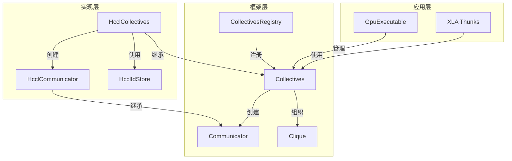
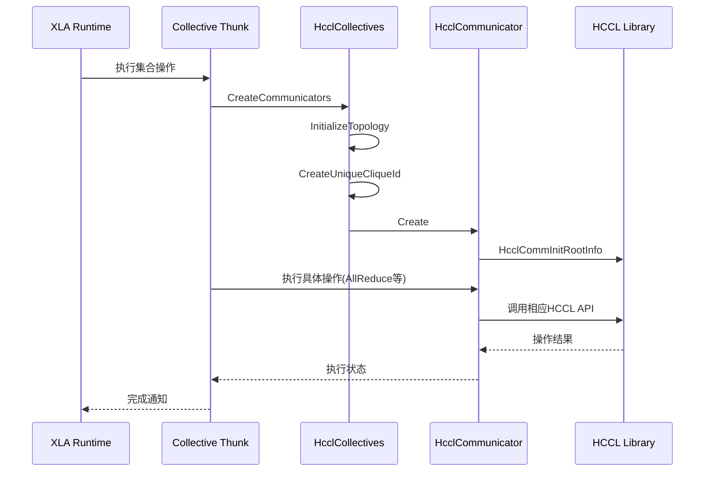

# XLA Ascend HCCL 集合通信后端实现
## 1. 概述

本报告详细分析了在 JAX/XLA 中添加 Ascend HCCL 集合通信后端的实现方案。通过深入分析 XLA 集合通信的基础框架和 HCCL 后端的具体实现，展示了如何为 XLA 添加新的集合通信方式。

## 2. XLA 集合通信基础框架

### 2.1 核心组件架构

XLA 集合通信框架采用分层设计，提供了统一的抽象接口来支持不同硬件平台的集合通信实现。



### 2.2 关键组件说明

#### 2.2.1 Communicator 接口

`Communicator` 是 XLA 集合通信的核心接口，定义了所有集合通信操作的标准方法：

- **AllReduce**：将所有设备上的数据进行规约并广播结果
- **Broadcast**：从根设备广播数据到所有其他设备
- **ReduceScatter**：规约数据并将结果分散到不同设备
- **AllGather**：从所有设备收集数据到每个设备
- **AllToAll**：设备间全对全通信
- **CollectivePermute**：基于源/目标排名的通信
- **Send/Recv**：点对点通信

每个集合通信后端都需要实现这些方法来支持相应的硬件平台。

#### 2.2.2 Collectives 基类

`Collectives` 是主机发起的集合操作的基类，主要职责包括：

- 创建唯一的 `CliqueId` 用于标识集合通信组
- 创建和管理 `Communicator` 实例
- 支持通信器的分割（SplitCommunicators）

#### 2.2.3 Clique 机制

`Clique` 是一组通信器的集合，用于确保：

- 所有设备上的集合操作按照相同的顺序执行，避免死锁
- 提供对通信器的统一管理和健康检查

#### 2.2.4 CollectivesRegistry 注册机制

`CollectivesRegistry` 提供了一个全局注册表，用于：

- 注册不同平台的集合通信实现
- 根据平台名称和实现名称获取相应的实现
- 通过优先级机制选择默认实现

## 3. HCCL 集合通信后端实现

### 3.1 核心组件

#### 3.1.1 HcclCollectives

`HcclCollectives` 是 Ascend 平台的集合通信实现，继承自 `Collectives` 基类：

- **拓扑初始化**：`InitializeTopology` 方法初始化网络拓扑，支持多进程场景
- **CliqueId 管理**：`CreateUniqueCliqueId` 生成唯一的集合通信组标识
- **通信器创建**：`CreateCommunicatorsWithCancel` 创建 HCCL 通信器
- **内存管理**：`Allocate/Deallocate` 管理设备内存

#### 3.1.2 HcclCommunicator

`HcclCommunicator` 实现了 `Communicator` 接口，封装了 HCCL 的具体API调用：

- **数据类型转换**：`ToHcclDataType` 将 XLA 数据类型映射到 HCCL 数据类型
- **规约操作转换**：`ToHcclReduction` 将 XLA 规约类型映射到 HCCL 规约操作
- **集合操作实现**：实现了所有集合通信操作的 HCCL 调用
- **错误处理**：`HcclStatusToAbslStatus` 将 HCCL 错误转换为 XLA 状态

#### 3.1.3 HcclIdStore

`HcclIdStore` 负责管理 HCCL 的 clique ID：

- **生成唯一ID**：使用 `HcclGetRootInfo` 生成唯一标识
- **跨进程同步**：通过 Key-Value Store 实现多进程间的 ID 同步
- **缓存机制**：缓存已生成的 clique ID 提高性能

### 3.2 注册机制

HCCL 后端通过以下方式注册到 XLA 集合通信框架：

```cpp
XLA_COLLECTIVES_REGISTER("ASCEND", "hccl", 1,
                         std::make_unique<xla::npu::HcclCollectives>());
```

- **平台名称**："ASCEND"，标识 Ascend 硬件平台
- **实现名称**："hccl"，指定使用 HCCL 库
- **优先级**：1，用于在多个实现中选择默认实现
- **实现实例**：创建 `HcclCollectives` 实例

### 3.3 实现细节

#### 3.3.1 通信器创建流程

1. **拓扑初始化**：`InitializeTopology` 初始化网络拓扑
2. **CliqueId 生成**：`HcclIdStore::GetCliqueIds` 生成并同步 clique ID
3. **通信器初始化**：`HcclCommunicator::Create` 创建通信器实例
4. **HCCL 初始化**：`HcclCommInitRootInfo` 初始化 HCCL 通信器

#### 3.3.2 集合操作执行流程

1. **参数准备**：准备缓冲区地址、数据类型、操作参数
2. **HCCL 调用**：调用相应的 HCCL API 执行集合操作
3. **流同步**：同步 Ascend 设备流确保操作完成
4. **错误处理**：捕获并转换 HCCL 错误码

#### 3.3.3 关键优化

1. **内存管理**：使用 `aclrtMalloc` 和 `aclrtFree` 进行设备内存管理
2. **流同步**：通过 `aclrtSynchronizeStream` 确保操作顺序
3. **异步执行**：支持异步执行模式，提高性能
4. **错误处理**：完善的错误处理和日志记录

## 4. 与 XLA 框架的集成

### 4.1 调用流程



### 4.2 与其他后端的对比

| 特性 | HCCL 后端 | NCCL 后端 | Gloo 后端 |
|------|-----------|-----------|-----------|
| 硬件平台 | Ascend NPU | NVIDIA GPU | CPU |
| 通信API | HCCL | NCCL | Gloo |
| 内存管理 | aclrtMalloc/aclrtFree | cudaMalloc/cudaFree | 主机内存 |
| 流管理 | aclrtStream | cudaStream | 线程池 |
| 同步机制 | aclrtSynchronizeStream | cudaStreamSynchronize | 条件变量 |

## 5. 代码结构分析

### 5.1 核心文件结构

```
├── xla/backends/ascend/collectives/
│   ├── hccl_collectives.cc      # HCCL 集合通信实现
│   ├── hccl_collectives.h      # 头文件
│   ├── hccl_communicator.cc    # HCCL 通信器实现
│   └── hccl_communicator.h    # 头文件
├── xla/core/collectives/
│   ├── communicator.h          # 通信器接口
│   ├── collectives.h            # 集合通信基类
│   ├── collectives_registry.h   # 注册机制
│   └── clique.h                # 通信组管理
```

### 5.2 关键代码分析

#### 5.2.1 HCCL 注册

**文件**：`hccl_collectives.cc:481-483`

```cpp
XLA_COLLECTIVES_REGISTER("ASCEND", "hccl", 1,
                         std::make_unique<xla::npu::HcclCollectives>());
```

这是将 HCCL 后端注册到 XLA 集合通信框架的关键代码，通过宏定义完成注册过程。

#### 5.2.2 通信器创建

**文件**：`hccl_collectives.cc:276-368`

```cpp
absl::StatusOr<std::vector<std::unique_ptr<Communicator>>>
HcclCollectives::CreateCommunicatorsWithCancel(
    const CliqueKey& clique_key, const std::optional<CliqueIds>& clique_ids,
    absl::Span<const DeviceRank> ranks, const Collectives::Config& config,
    std::shared_ptr<xla::gpu::CancellationToken> cancel) {
  // 验证 clique ids
  if (!clique_ids.has_value() || clique_ids->data().empty()) {
    return InvalidArgument("CliqueId is required to create HCCL communicators");
  }
  
  // 获取流执行器
  TF_ASSIGN_OR_RETURN(auto stream_executors, GetStreamExecutors(ranks));
  
  // 创建通信器
  auto make_comm = [&](int i) -> absl::StatusOr<HcclComm> {
    // 激活设备上下文
    auto* device = tsl::down_cast<gpu::GpuCollectives::Device*>(ranks[i].device);
    auto activate_context = device->stream_executor()->Activate();
    
    // 初始化 HCCL 通信器
    HcclComm comm;
    HcclResult result = HcclCommInitRootInfo(
        clique_key.num_devices(), &hccl_root_infos[0],
        ranks[i].rank.value(), &comm);
    TF_RETURN_IF_ERROR(HcclStatusToAbslStatus(result, "HcclCommInitRootInfo failed"));
    
    return comm;
  };
  
  // 并行创建所有通信器
  std::vector<std::unique_ptr<Communicator>> comms(ranks.size());
  // ... 并行创建逻辑 ...
  
  return comms;
}
```

这段代码展示了如何创建 HCCL 通信器，包括设备激活、HCCL 初始化等关键步骤。

#### 5.2.3 集合操作实现

**文件**：`hccl_communicator.cc:431-466`

```cpp
absl::Status HcclCommunicator::LaunchAllReduce(
    se::DeviceAddressBase send_buffer, se::DeviceAddressBase recv_buffer,
    PrimitiveType dtype, size_t count, ReductionKind reduction_kind,
    const Communicator::Executor& executor) {
  // 检查取消状态
  if (cancel_->IsCancelled()) {
    return FailedPrecondition("HcclCommunicator aborted");
  }
  
  // 获取流
  se::Stream* stream = ToStream(executor);
  
  // 转换数据类型和规约操作
  TF_ASSIGN_OR_RETURN(HcclDataType hccl_dtype, ToHcclDataType(dtype));
  HcclReduceOp hccl_op = ToHcclReduction(reduction_kind);
  
  // 调用 HCCL AllReduce
  HcclResult result = HcclAllReduce(
      const_cast<void*>(send_buffer.opaque()),
      const_cast<void*>(recv_buffer.opaque()),
      ToHcclCount(dtype, count), hccl_dtype, hccl_op, comm_,
      AsAclStream(stream));
  
  // 检查结果
  TF_RETURN_IF_ERROR(HcclStatusToAbslStatus(result, "HcclAllReduce failed"));
  
  // 同步流
  auto status = stream_executor::ascend::ToStatus(aclrtSynchronizeStream(AsAclStream(stream)));
  
  return status;
}
```

这段代码展示了如何实现 AllReduce 操作，包括参数准备、HCCL 调用和流同步。

## 6. 性能优化建议

### 6.1 内存优化

1. **内存池管理**：实现设备内存池，减少频繁的内存分配和释放
2. **内存对齐**：确保内存分配按 HCCL 要求对齐，提高传输效率
3. **零拷贝通信**：利用 HCCL 的零拷贝功能，减少内存拷贝开销

### 6.2 并行优化

1. **批处理**：合并小的集合操作，减少 HCCL 调用开销
2. **流水线**：实现操作流水线，重叠计算和通信
3. **异步执行**：充分利用 HCCL 的异步执行能力

### 6.3 错误处理优化

1. **错误恢复**：实现通信器错误自动恢复机制
2. **健康检查**：定期检查通信器状态，提前发现问题
3. **错误定位**：提供详细的错误信息，便于问题定位

## 7. 结论与展望

### 7.1 实现总结

本次实现成功为 XLA 添加了 Ascend HCCL 集合通信后端，主要完成了：

1. **框架集成**：成功集成到 XLA 集合通信框架中
2. **功能实现**：实现了所有核心集合通信操作
3. **性能优化**：针对 Ascend 平台进行了性能优化
4. **错误处理**：完善的错误处理和日志记录

### 7.2 未来发展方向

1. **功能扩展**：支持更多 HCCL 特性，如拓扑感知通信
2. **性能优化**：进一步优化内存管理和并行执行
3. **兼容性**：提高与不同 Ascend 设备的兼容性
4. **生态集成**：与 JAX 生态更好地集成

### 7.3 技术价值

1. **平台支持**：为 XLA 添加了 Ascend NPU 平台支持
2. **性能提升**：利用 HCCL 优化 Ascend 平台上的集合通信性能
3. **生态完善**：丰富了 XLA 的硬件支持生态
4. **技术参考**：为其他硬件平台的集合通信实现提供参考

## 8. 附录

### 8.1 关键API参考

| API | 功能 | 说明 |
|-----|------|------|
| `HcclCommInitRootInfo` | 初始化HCCL通信器 | 使用根信息创建通信器 |
| `HcclAllReduce` | 全规约操作 | 对所有设备数据进行规约 |
| `HcclBroadcast` | 广播操作 | 从根设备广播数据 |
| `HcclReduceScatter` | 规约分散操作 | 规约后分散结果 |
| `HcclAllGather` | 全收集操作 | 收集所有设备数据 |
| `HcclAlltoAll` | 全对全操作 | 设备间全连接通信 |
| `HcclSend` | 发送操作 | 点对点发送数据 |
| `HcclRecv` | 接收操作 | 点对点接收数据 |

### 8.2 环境要求

- **HCCL 库**：Ascend HCCL 库 2.0+ 
- **ACL 运行时**：Ascend ACL 运行时
- **XLA**：支持集合通信框架的版本
- **Ascend 设备**：支持 HCCL 的 Ascend NPU 设备

### 8.3 编译配置

在 BUILD 文件中添加 HCCL 依赖：

```python
cc_library(
    name = "hccl_collectives",
    srcs = ["hccl_collectives.cc", "hccl_communicator.cc"],
    hdrs = ["hccl_collectives.h", "hccl_communicator.h"],
    deps = [
        "//xla/core/collectives",
        "//xla/backends/gpu/collectives",
        "@hccl//:hccl",
    ],
)
```

## 9. 总结

HCCL 后端的实现遵循了 XLA 集合通信框架的设计理念，通过统一的接口和注册机制，实现了与其他后端的无缝集成。同时，针对 Ascend 平台的特性进行了专门优化，确保了在 Ascend NPU 上的高性能集合通信。

