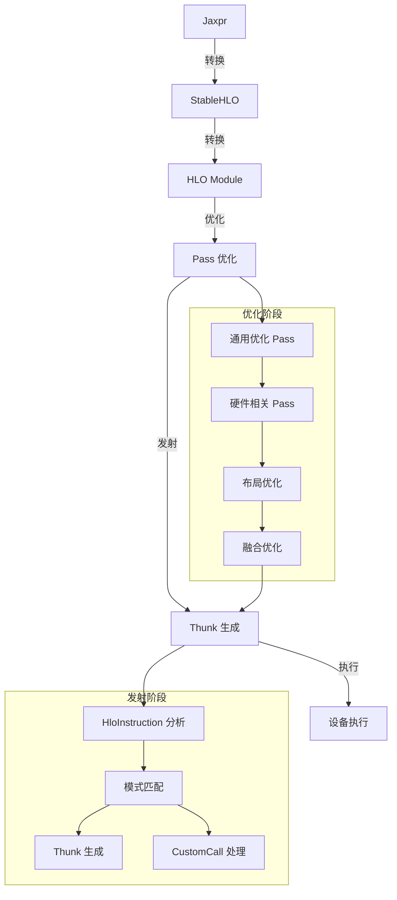
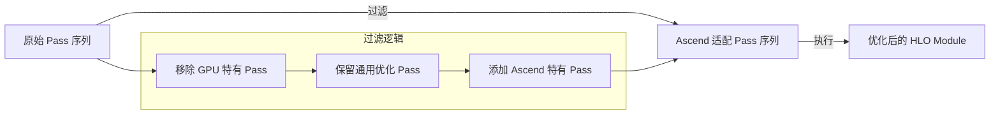
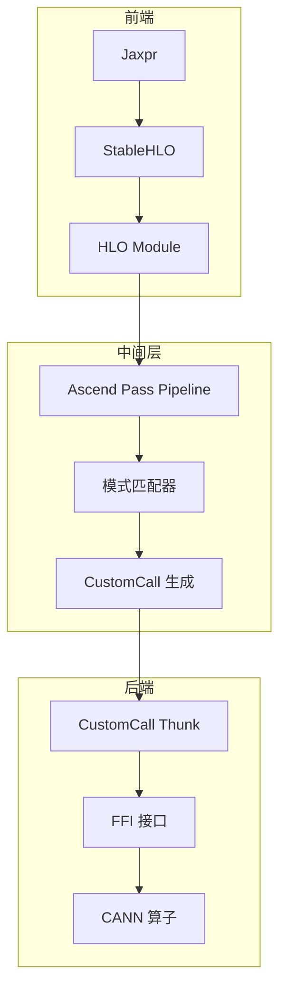

# XLA Ascend 后端适配分析报告

## 1. XLA 编译架构

### 1.1 整体编译流程



### 1.2 关键组件关系

| 组件 | 功能 | 说明 |
|------|------|------|
| Jaxpr | JAX 计算表示 | JAX 内部计算图表示 |
| StableHLO | 稳定的 HLO 表示 | 跨框架的 HLO 标准 |
| HLO Module | XLA 计算图 | 由 HloInstruction 组成 |
| Pass 系统 | 编译优化 | 包括通用优化和硬件相关优化 |
| Thunk | 执行单元 | 对应设备上的具体操作 |
| FFI 机制 | 外部函数接口 | 用于调用外部库函数 |

## 2. Ascend 后端适配策略

### 2.1 Pass 优化适配

#### 2.1.1 需要调整的 Pass

1. **硬件相关 Pass**
   - 规避 GPU 特有的优化逻辑
   - 移除 CUDA/NCCL 相关依赖
   - 适配 Ascend 硬件特性

2. **需要保留的 Pass**
   - 通用优化 Pass（如常量折叠、死代码消除）
   - 布局优化（需适配 Ascend 内存布局）
   - 融合优化（需考虑 Ascend 核函数融合特性）

#### 2.1.2 Pass 调整策略



### 2.2 Thunk 发射策略

#### 2.2.1 模式匹配与 CustomCall

1. **模式匹配**
   - 识别可直接映射到 CANN 算子的 HLO 模式
   - 构建模式匹配规则库
   - 优先匹配高频算子

2. **CustomCall 生成**
   - 为匹配到的模式生成 CustomCall
   - 设置正确的后端配置和属性
   - 传递必要的参数和形状信息

#### 2.2.2 FFI 调用机制

1. **FFI 接口设计**
   - 定义统一的 FFI 接口
   - 封装 CANN 算子调用
   - 处理参数转换和错误处理

2. **执行流程**
   ```mermaid
   sequenceDiagram
       participant Thunk as CustomCall Thunk
       participant FFI as FFI 接口
       participant CANN as CANN 算子库
       
       Thunk->>FFI: 调用 FFI 函数
       FFI->>CANN: 调用 CANN 算子
       CANN-->>FFI: 返回执行结果
       FFI-->>Thunk: 返回状态
   ```

## 3. 具体实现步骤

### 3.1 后端注册与初始化

1. **后端注册**
   - 实现 `AscendCompiler` 类
   - 注册到 XLA 编译器注册表
   - 配置后端特定参数

2. **初始化流程**
   - 加载 CANN 库
   - 初始化设备
   - 设置默认配置

### 3.2 Pass 系统适配

1. **Pass 过滤**
   - 实现 `AscendPassPipeline`
   - 过滤 GPU 特有 Pass
   - 添加 Ascend 优化 Pass

2. **Pass 实现**
   - 实现 Ascend 特有的布局优化
   - 实现 Ascend 特有的融合策略
   - 实现 Ascend 内存管理优化

### 3.3 Thunk 发射实现

1. **CustomCall 生成**
   - 实现 `AscendThunkEmitter`
   - 构建模式匹配规则
   - 生成 CustomCall 指令

2. **FFI 实现**
   - 实现 CANN 算子封装
   - 处理数据类型转换
   - 管理设备内存

## 4. 性能优化考虑

### 4.1 内存优化

1. **内存布局**
   - 优化 Ascend 内存布局
   - 减少内存拷贝
   - 利用 Ascend 内存层次

2. **内存管理**
   - 实现高效的内存池
   - 优化内存分配策略
   - 减少内存碎片

### 4.2 计算优化

1. **算子融合**
   - 识别适合 Ascend 的融合模式
   - 生成优化的融合核函数

2. **并行优化**
   - 利用 Ascend 多核心
   - 优化执行调度
   - 实现流水线执行

## 5. 实现架构



## 6. 总结

通过以上策略，我们可以为 XLA 添加 Ascend 后端，实现以下目标：

1. **架构一致性**：保持与 XLA 现有架构的一致性
2. **性能优化**：针对 Ascend 硬件特性进行优化
3. **代码复用**：复用 XLA 现有的优化 Pass
4. **灵活性**：通过 CustomCall 和 FFI 机制实现灵活的算子映射

这种方案既保证了与 XLA 框架的兼容性，又充分利用了 Ascend 硬件的特性，为 JAX 在 Ascend 平台上的运行提供了高效的支持。